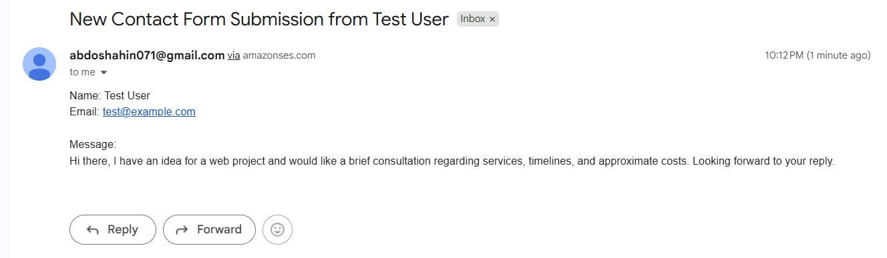
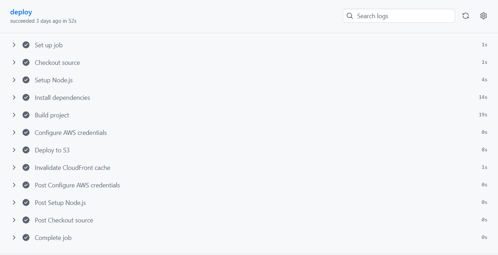

 # Abdelrahman Mahmoud - Portfolio Website

 A modern, responsive portfolio website built with Next.js and TailwindCSS. This repository is configured for static export and intended to be hosted on AWS S3 with CloudFront. The contact form posts directly to an AWS API Gateway endpoint which triggers a Lambda function that sends email through Amazon SES.

 ## Table of Contents

 - [Overview](#overview)
 - [Architecture](#architecture)
 - [Project structure](#project-structure)
 - [Local development](#local-development)
 - [Build & static export](#build--static-export)
 - [Deploy to AWS S3 + CloudFront](#deploy-to-aws-s3--cloudfront)
 - [Contact form (API Gateway → Lambda → SES)](#contact-form-api-gateway-→-lambda-→-ses)
 - [CI/CD (GitHub Actions) example](#cicd-github-actions-example)
 - [Troubleshooting](#troubleshooting)
 - [Next steps](#next-steps)

 ## Overview

 This site uses Next.js (App Router) with TailwindCSS and shadcn/ui components. It's optimized for a fast, static export (`next export`) so it can be served from S3 behind CloudFront. The contact form is implemented as a client-side POST to an API endpoint (set using `NEXT_PUBLIC_API_GATEWAY_URL`).

 ## Architecture

 High level flow:

 - User (browser) → CloudFront → S3 (static site)
 - Contact form (client) → API Gateway (public endpoint) → Lambda → SES → Recipient inbox
 - CI/CD: GitHub Actions → build & export → sync to S3 → invalidate CloudFront
 
```


 ```
## ✨ Features

- Static, globally distributed portfolio website
- CloudFront CDN caching
- SES-powered contact form
- Fully serverless backend
- Zero-downtime deployments
- Automated invalidation
- GitHub Actions CI/CD

 ## Project structure (key files)

 - `app/` — Next.js App Router pages
 - `components/` — UI components (contact form, navbar, footer, project card)
 - `components/ui/` — shared shadcn UI primitives
 - `lib/utils.ts` — small helpers
 - `aws/contact-form-lambda.ts` — example Lambda (SES email sender)
 - `next.config.mjs` — Next.js configuration (set to `output: 'export'` for static export)

 ## 🛠️ Tech Stack

- **Next.js** (App Router)
- **TailwindCSS**
- **Shadcn/UI**
- **AWS S3**
- **AWS CloudFront**
- **AWS API Gateway**
- **AWS Lambda**
- **Amazon SES**
- **GitHub Actions**

 ## Local development

 Prerequisites: Node.js 18+ and npm (or pnpm/yarn).

 1. Install dependencies:

    npm install

 2. Run dev server:

    npm run dev

 3. Open: http://localhost:3000

 ## Build & static export

 1. Build the project (creates static output):

    npm run build

 2. The static files will be available in the `out/` folder (configured by `next export`).

 ## Deploy to AWS S3 + CloudFront

 1. Create an S3 bucket and enable static website hosting (index.html, 404.html).
 2. Upload `out/` contents to the bucket, for example via AWS CLI:

    aws s3 sync out/ s3://your-bucket-name --delete

 3. Create a CloudFront distribution using the S3 bucket as origin. Use an Origin Access Control (OAC) and set the default root object to `index.html`.
 4. Update bucket policy to allow CloudFront access. Optionally configure custom domain and ACM certificate.
 5. After updates, invalidate CloudFront cache:

    aws cloudfront create-invalidation --distribution-id YOUR_DIST_ID --paths "/*"

 ## Contact form (API Gateway → Lambda → SES)

 - Frontend expects `NEXT_PUBLIC_API_GATEWAY_URL` to be set to your API Gateway POST endpoint.
 - The Lambda example (`aws/contact-form-lambda.ts`) reads `RECIPIENT_EMAIL` and `SENDER_EMAIL` from environment variables and calls SES to send an email.

 Lambda notes:
 - Ensure `SENDER_EMAIL` is verified in SES (or that your SES account is out of the sandbox).
 - Lambda needs IAM permission: `ses:SendEmail` (and `ses:SendRawEmail` if you use raw payloads).

 ## CI/CD (GitHub Actions) example

 A minimal workflow:

 - Checkout
 - Setup Node.js
 - Install dependencies
 - Build
 - Upload artifacts or sync `out/` with AWS S3 (using `aws-actions/configure-aws-credentials` and `aws s3 sync`)
 - Create CloudFront invalidation

 ## Screenshots

### Architecture Diagram


### Email delivered via SES


### CI/CD Pipeline (GitHub Actions)



 ## Troubleshooting

 - If emails aren't delivered: verify SES sender, check CloudWatch logs for Lambda errors, ensure API Gateway returns 200/2xx.
 - If form fails on static site: ensure `NEXT_PUBLIC_API_GATEWAY_URL` is set in the hosting environment or in the build step.
 - If CloudFront returns 403: check S3 bucket policy and OAC configuration.

 ---

 Built with Next.js and TailwindCSS. If you'd like, I can also add a ready-to-use GitHub Actions workflow and a sample architecture PNG in `docs/`.
